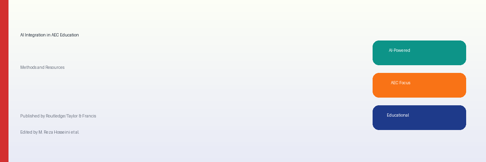
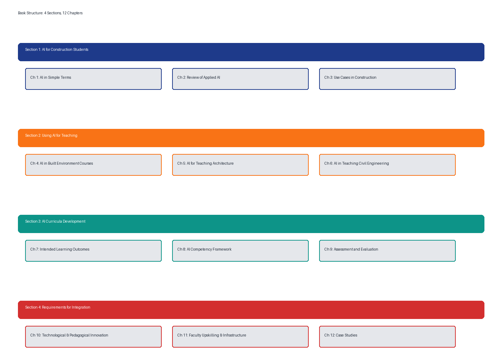

# AI Integration in AEC Education
### Methods and Resources

Welcome to the official repository for the upcoming book on **AI in Construction Education**. This repository serves as a living resource for educators, students, and practitioners.

---

## 📚 Book Structure

## 🗺️ Learning Pathways

## 📂 Repository Contents
- **`/chapters`**: Content organized by the 4 main book sections.
- **`/resources`**: Slide decks, lecture notes, and assessment templates.
- **`/docs`**: Project documentation and guidelines.

---
*Published by Routledge/Taylor & Francis | Edited by Dr. M. Reza Hosseini*
