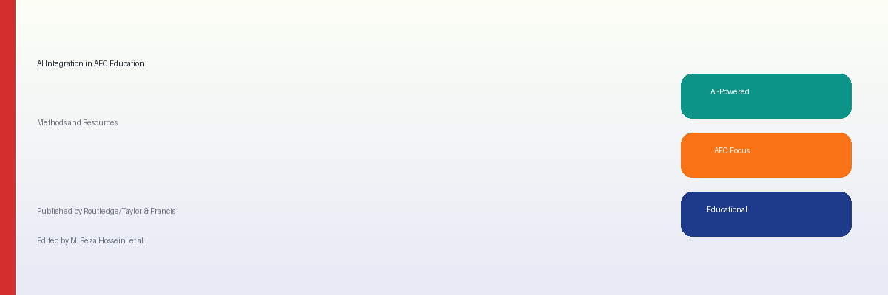

# AI Integration in AEC Education
### Supplementary Material and Companion Resources

Welcome to the official companion repository for the book **AI Integration in AEC Education** (Routledge/Taylor & Francis, ed. Dr M. Reza Hosseini). This repository hosts figures, datasets, code examples, and appendices for the 16 chapters.

---

## 📚 Book Structure & Chapter Status

### Part I: Foundations
- **Chapter 1:** Artificial Intelligence (AI) in Simple Terms *(Publisher final)*
- **Chapter 2:** Integrating AI Literacy into Construction Education *(Publisher final)*
- **Chapter 3:** The Impact of Generative Artificial Intelligence on Built Environment and Engineering Education *(Accepted)*
- **Chapter 4:** When Technical Outputs No Longer Demonstrate Competence *(Forthcoming)*
- **Chapter 5:** Beyond the Algorithm: Your Role in Ethical AI Deployment *(Forthcoming)*

### Part II: Teaching, Curriculum, Professional Formation
- **Chapter 6:** AI in Construction: Identifying Competencies and Analysing Teaching Methods *(Accepted)*
- **Chapter 7:** Embedding AI in Existing and New Curricula *(Accepted)*
- **Chapter 8:** Guidelines and Benefits of GPT/LLM in Construction Management Education *(Forthcoming)*
- **Chapter 9:** Large Language Models (LLMs) for Adaptive and Personalized Learning *(Accepted)*
- **Chapter 10:** The Automation of Thinking? AI and the Future of Professional Judgement *(Forthcoming)*

### Part III: Data, Infrastructure, Applied AI Capabilities
- **Chapter 11:** The Digital Blueprint: Structuring Heterogeneous Construction Data *(Accepted)*
- **Chapter 12:** Data Centres for the AI Era: A Construction Manager's Guide *(Accepted)*
- **Chapter 13:** AI-Assisted Programming in Construction Education *(Accepted)*
- **Chapter 14:** Digital Twins as Pedagogical Tools for Construction 4.0 *(Accepted)*
- **Chapter 15:** Agentic AI in Construction: Frameworks, Use Cases, and Practical Governance *(Accepted)*

### Part IV: Capstone
- **Chapter 16:** Operationalising AI Ethics in Construction: Principles, Governance, and Tools *(Accepted)*

---

## 📂 Repository Organization
All resources are organized by chapter in the `/chapters` directory. See [REPOSITORY-STRUCTURE.md](REPOSITORY-STRUCTURE.md) for details on what is included in each chapter's folder.

## 🤝 Contributing
If you are an author looking to upload your materials, please read [CONTRIBUTING.md](CONTRIBUTING.md) for submission instructions.

---
*Published by Routledge/Taylor & Francis | Edited by Dr. M. Reza Hosseini*
