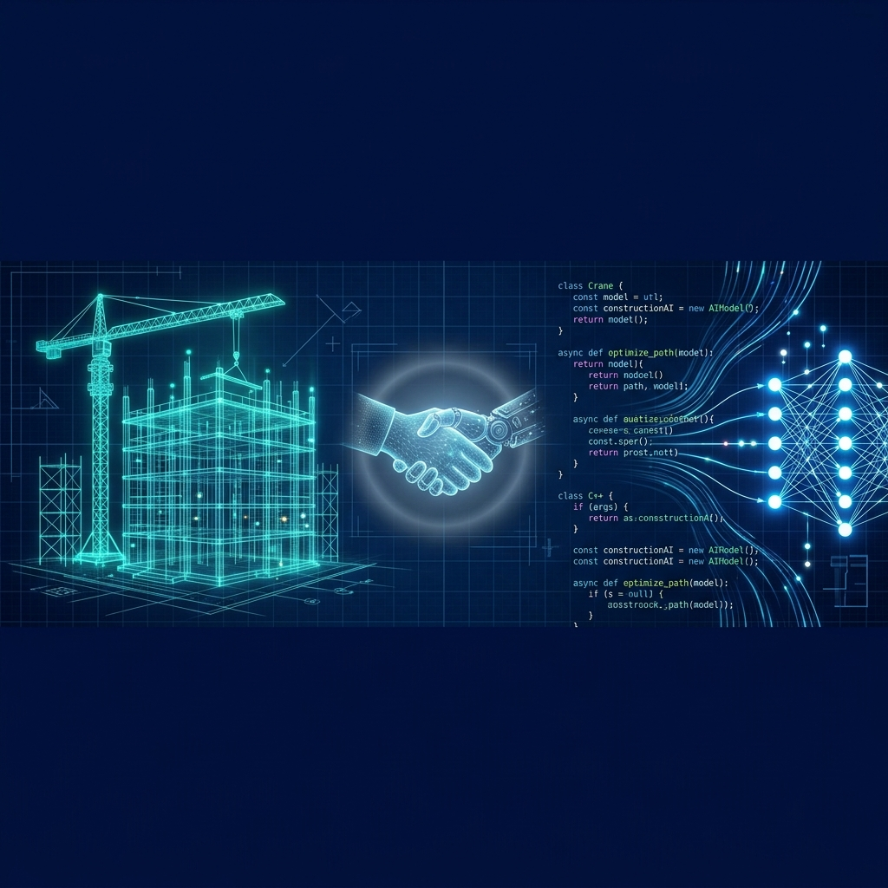
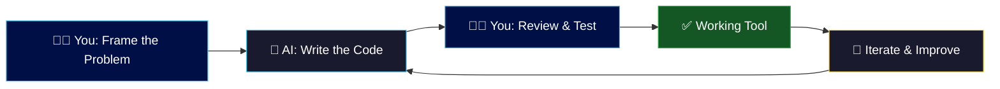
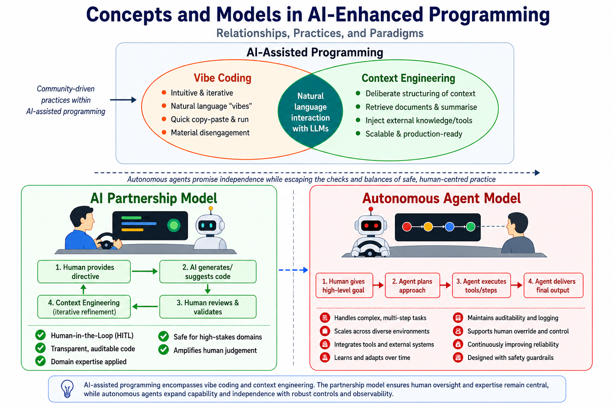
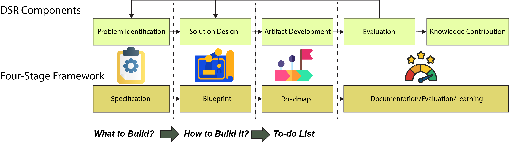
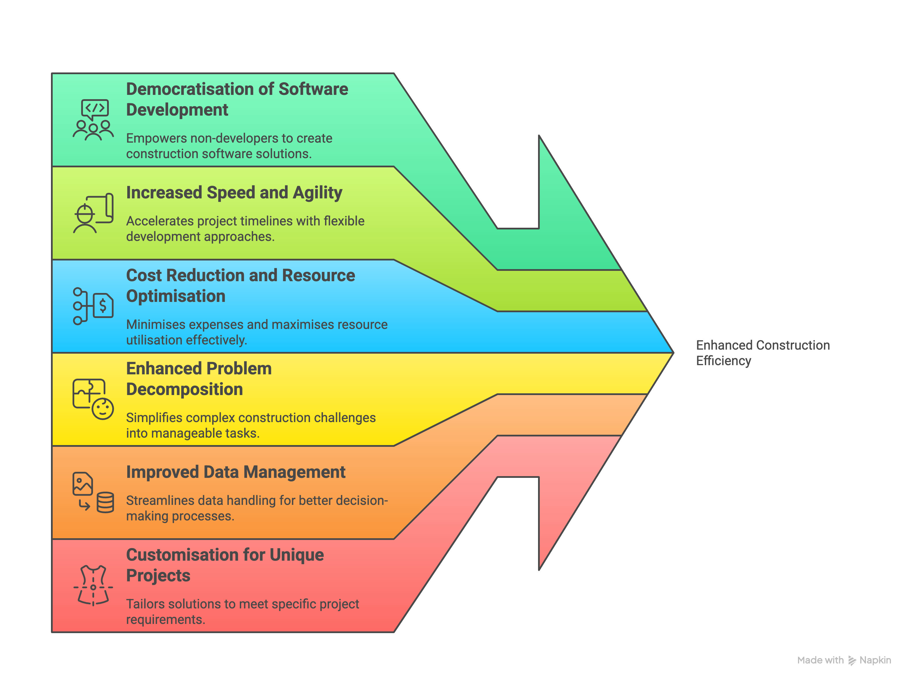
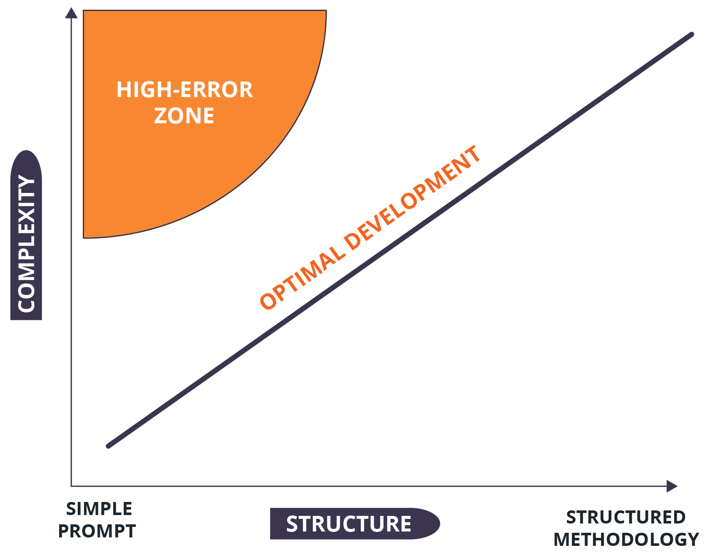
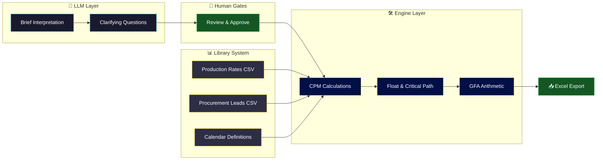

<p align="center">
  
</p>

<h1 align="center">🏗️ AI-Assisted Programming</h1>
<h3 align="center"><em>for Construction Professionals</em></h3>

<p align="center">
  
  
  
  
</p>

<p align="center">
  <strong>Authors:</strong> M. Reza Hosseini · Xiao Xie · Rodrigo F. Herrera · Mohamad Kassem
</p>

---

## 🎯 What This Chapter Is About

> **You don't need to become a programmer. You need to learn how to *direct* one.**

This chapter teaches construction professionals to build their own digital tools using AI as a coding partner. The professional frames the problem, the AI writes the code, and the human reviews, tests, and takes ownership of the result.

It's not about replacing developers. It's about **unlocking capability** — giving you the skills to turn an idea into a working tool in hours, not months.



---

## 🧠 Key Concepts at a Glance

<p align="center">
  
  <br><em>Figure 2. Relationships among AI-assisted programming concepts and terms</em>
</p>

| Concept | What It Means | Why It Matters |
|:--------|:-------------|:--------------|
| 🤝 **AI Partnership Model** | Human directs, AI generates code, human reviews and validates | Safe for high-stakes domains — every decision is visible and reversible |
| 🎶 **Vibe Coding** | Intuitive, natural-language-driven development where you "give in to the vibes" | Lowers the barrier to entry — you describe *what* you want, not *how* |
| 🎯 **Context Engineering** | Deliberately structuring everything the LLM needs to complete a task | The evolution of prompt engineering — you stay in control of AI output |
| 🧬 **Hybrid Architecture** | LLM for interpretation + Python for calculation | AI handles language; code handles maths — each does what it's best at |
| 📊 **Data Grounding** | Using curated rate libraries instead of AI guesses | Durations come from real data, not hallucinations |

---

## 🛡️ AI Partnership vs Autonomous Agents

This chapter specifically focuses on the **AI Partnership Model** — not autonomous agents. The distinction is critical:

| | AI Partnership (This Chapter) | Autonomous Agents |
|:-:|:------|:------|
| **Control** | Human provides directives at every step | Human gives a high-level goal; agent acts independently |
| **Review** | Human reviews and validates every output | Agent plans, executes, and delivers final output |
| **Safety** | Human-in-the-Loop (HITL) — transparent and auditable | Requires safety guardrails and logging |
| **Best for** | High-stakes, domain-specific tools | Complex, multi-step automation tasks |

> [!NOTE]
> For the autonomous agent approach, see the companion chapter on **Agentic AI** in this book.

---

## 📐 The Four-Stage DSR Framework

The chapter proposes a structured methodology for AI-assisted development, grounded in Design Science Research (DSR):

<p align="center">
  
  <br><em>Figure 8. DSR Integration with Four-Stage AI-Assisted Programming Framework</em>
</p>

| Stage | Focus | Output |
|:-----:|:------|:-------|
| **1. Specification** | AI-facilitated interview to define *what* to build | Developer-ready project specification |
| **2. Blueprint** | Transform specs into *how* to build it | Multi-phase technical blueprint with system prompts |
| **3. Roadmap** | Break the blueprint into a *to-do list* | Checkpoint-based implementation roadmap |
| **4. Documentation** | Capture the process, evaluate, and learn | Lessons learned repository + evaluation report |

---

## 📈 Why This Matters for Construction

<p align="center">
  
  <br><em>Figure 3. Key benefits of programming for construction management professionals</em>
</p>

<details>
<summary>🔍 <strong>Overcoming "Code Fear"</strong> (click to expand)</summary>
<br>

For many students from non-IT backgrounds, the prospect of learning programming can be daunting — a phenomenon termed **"code fear"**. AI-assisted tools directly address this by:

- Translating natural language into working code
- Providing real-time explanations and debugging help
- Allowing focus on **problem decomposition** rather than syntax
- Creating a safe environment for iterative experimentation

<p align="center">
  
  <br><em>Figure 7. The relationship between project complexity and required structural methodology</em>
</p>

</details>

---

## 📦 What's Inside

This chapter comes with **three complete, runnable resources** — not just theory.

### 1️⃣ Cost Analysis — Your First AI-Generated Script

> 📂 [`code/cost-analysis/`](code/cost-analysis/)

A small Python script that analyses construction cost data — generated from a single, well-constrained prompt. **Start here.**

<details>
<summary>💡 <strong>The prompt that created this tool</strong> (click to expand)</summary>
<br>

> *Write a Python script that analyses construction cost data from a CSV file.*  
> *Constraints:*  
> *- Use only the pandas and matplotlib libraries.*  
> *- Do not call external APIs or require internet access.*  
> *- Handle missing or invalid values rather than failing on them.*  
> *- For each work package, calculate the variance between budgeted and actual cost.*  
> *- Produce a bar chart of cost variance by work package and save it as an image file.*

</details>

**What it does:** reads a CSV → computes budget variance per work package → produces a colour-coded bar chart

**Run it in 3 commands:**
```bash
cd code/cost-analysis
pip install pandas matplotlib
python construction_cost_analysis.py
# → Produces cost_variance.png ✅
```

> [!TIP]
> **Student exercise:** Modify the prompt to add a "percentage over budget" column and a summary table. Re-run the AI generation and compare the output.

---

### 2️⃣ Construction Planning App — The Full Worked Example

> 📂 [`code/construction-planning-app/`](code/construction-planning-app/)

A complete Streamlit application that takes a one-line project brief and scaffolds a professional CPM schedule. This is the chapter's main case study — a real tool built entirely with AI assistance.



<details>
<summary>📋 <strong>Architecture breakdown</strong> (click to expand)</summary>
<br>

| Layer | Role | Technology |
|:------|:-----|:-----------|
| **🤖 LLM Layer** | Interprets briefs, generates narrative, asks questions | Google Gemini API |
| **🛠️ Engine Layer** | CPM calculations, float, GFA arithmetic | Deterministic Python |
| **📊 Library System** | Production rates, procurement leads, calendars | Static CSV/JSON files |
| **🖥️ UI Layer** | Interactive multi-page interface | Streamlit |

**Key design principle:** The LLM never does maths. It reads and writes. Python calculates. Data libraries provide the facts.

</details>

**▶️ Try the live demo:**  
🔗 [**teaching-tools-falzwuuzw6rq8ntn93prcg.streamlit.app**](https://teaching-tools-falzwuuzw6rq8ntn93prcg.streamlit.app)

**Run locally:**
```bash
cd code/construction-planning-app
pip install -r requirements.txt
export GEMINI_API_KEY=your_key_here
streamlit run app/main.py
# → Open http://localhost:8501 ✅
```

> [!NOTE]
> The live demo requires a Gemini API key. You can still explore all source code, static libraries, and the CPM engine without one.

---

### 3️⃣ Development History — How It Was Actually Built

> 📂 [`code/development-history/`](code/development-history/)

The full, transparent record of how the planning application evolved — including the **critical design pivot** from full automation to human-in-the-loop scaffolding.

| Document | What You'll Learn |
|:---------|:-----------------|
| 📖 [`DEVELOPMENT_JOURNEY.md`](code/development-history/DEVELOPMENT_JOURNEY.md) | The narrative of the full build — from hypothesis to working app |
| 📐 [`planning/`](code/development-history/planning/) | Architecture analysis, approach docs, and final implementation plan |

> [!IMPORTANT]
> **Why this matters:** Most AI tutorials show you the finished product. This folder shows you the *messy middle* — the failed assumptions, the expert critiques, and the redesigns. That's where the real learning happens.

---

## 🚀 Getting Started — Pick Your Path

Choose the path that matches your goals:

```
🟢 Beginner          → Start with the Cost Analysis example (30 min)
🟡 Intermediate      → Explore the Planning App source code (1-2 hrs)
🔴 Deep Dive         → Read the Development History, then modify the app (half day)
```

| Step | What to Do | Time |
|:----:|:-----------|:----:|
| **1** | Run the [cost analysis script](code/cost-analysis/) and read the prompt that generated it | 30 min |
| **2** | Try the [live planning app](https://teaching-tools-falzwuuzw6rq8ntn93prcg.streamlit.app) with a real project brief | 15 min |
| **3** | Open `code/construction-planning-app/app/core/` — find where AI stops and Python starts | 45 min |
| **4** | Read the [Development Journey](code/development-history/DEVELOPMENT_JOURNEY.md) — trace the design pivot | 30 min |
| **5** | Write your own constrained prompt for a construction problem you care about | ∞ |

---

## 🎓 For Educators

<details>
<summary><strong>Ready-made teaching activities</strong> (click to expand)</summary>
<br>

| Activity | Duration | Level | Description |
|:---------|:--------:|:-----:|:------------|
| **Prompt Lab** | 45 min | 🟢 | Students modify the cost analysis prompt, add constraints, compare outputs |
| **Architecture Autopsy** | 60 min | 🟡 | Groups map the planning app's code to the hybrid architecture diagram |
| **Design Critique** | 45 min | 🟡 | Read the Development Journey; identify the design decisions you disagree with |
| **Build Your Own** | 3 hrs | 🔴 | Students use the DSR framework to build a tool for their own construction problem |
| **Ethics Debate** | 30 min | 🟢 | Should AI-generated code be used in safety-critical construction applications? |

</details>

---

## 📚 Further Reading

*Coming soon.*

---

## 📝 Citation

```bibtex
@incollection{hosseini2026ai,
  author    = {Hosseini, M. Reza and Xie, Xiao and Herrera, Rodrigo F. and Kassem, Mohamad},
  title     = {AI-Assisted Programming for Construction Professionals},
  booktitle = {AI Integration in Construction Education: Methods and Resources},
  editor    = {Hosseini, M. Reza},
  publisher = {Routledge/Taylor \& Francis},
  year      = {2026}
}
```

---

<p align="center">
  <em>Part of</em> <a href="../../../"><strong>AI Integration in AEC Education</strong></a> · <em>Section 2: Teaching with AI</em>
</p>
