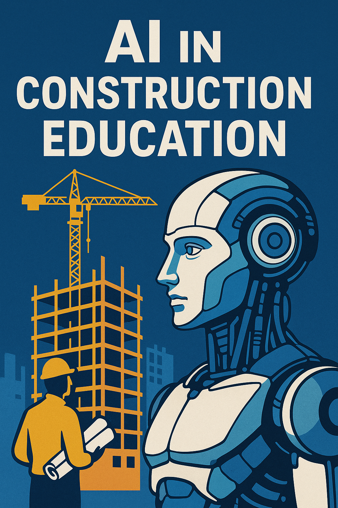

# AI Integration in Construction Education

## About the Book

"AI Integration in Construction Education: Methods and Resources" provides a comprehensive framework for educators to incorporate artificial intelligence concepts into construction education curricula.

### Key Features

- **Practical Teaching Resources**: Ready-to-use lesson plans, exercises, and assessments
- **Code Examples**: Hands-on AI applications specific to construction challenges
- **Implementation Guidelines**: Step-by-step guidance for educators at various levels
- **Industry Connections**: Materials that bridge academic learning with industry practice

[Explore Chapters](#chapters) | [Download Resources](#resources) | [About the Author](#author)

---

## Book Chapters

Explore the supplementary materials for each chapter:

- [Chapter 1](Chapters/Chapter1/) - Introduction to AI in Construction
- [Chapter 2](Chapters/Chapter2/) - Machine Learning Fundamentals
- [Chapter 3](Chapters/Chapter3/) - Data Collection and Processing
- [Chapter 4](Chapters/Chapter4/) - AI Applications in Construction Management
- [Chapter 5](Chapters/Chapter5/) - Building Information Modeling and AI
- [Chapter 6](Chapters/Chapter6/) - Computer Vision in Construction
- [Chapter 7](Chapters/Chapter7/) - Natural Language Processing for Construction
- [Chapter 8](Chapters/Chapter8/) - Predictive Analytics in Construction
- [Chapter 9](Chapters/Chapter9/) - AI Ethics and Implementation Challenges
- [Chapter 10](Chapters/Chapter10/) - Case Studies of AI in Construction Education
- [Chapter 11](Chapters/Chapter11/) - Assessment Frameworks for AI Learning
- [Chapter 12](Chapters/Chapter12/) - Future Trends and Opportunities

---

## Featured Resources

- [AI Tools for Construction Education](resources/ai-tools.md)
- [Dataset Collections](resources/datasets.md)
- [Implementation Case Studies](resources/case-studies.md)

---

## About the Author

Dr. M. Reza Hosseini is a Senior Lecturer in Construction Technology at the University of Melbourne, specializing in AI applications for construction engineering and education.

[View GitHub](https://github.com/morehosseini) | [University Profile](https://www.unimelb.edu.au/)
